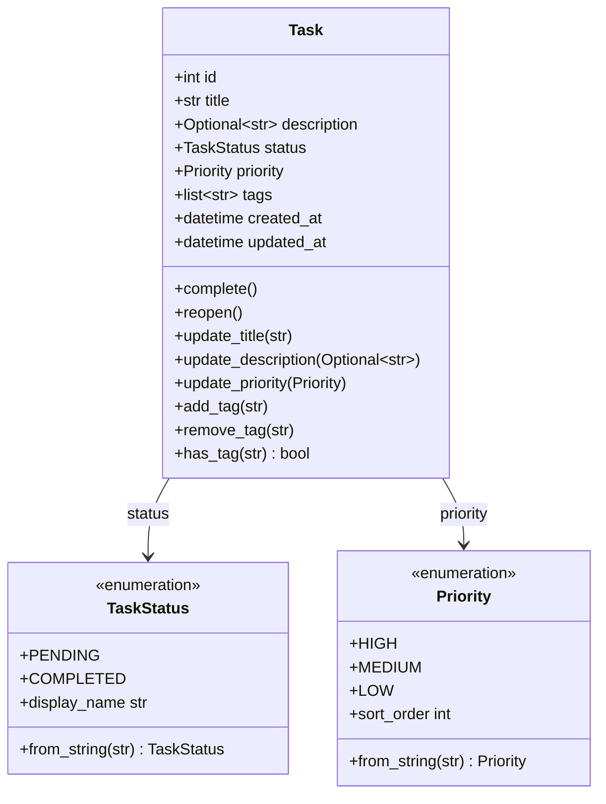

# Data Model: Task Organization

**Feature**: 004-task-organization
**Date**: 2026-01-02

## Entity Diagram

```
┌─────────────────────────────────────────────────────────────────┐
│                            Task                                  │
├─────────────────────────────────────────────────────────────────┤
│ - id: int                                                       │
│ - title: str                                                    │
│ - description: Optional[str]                                    │
│ - status: TaskStatus                                            │
│ - priority: Priority        ← NEW FIELD                         │
│ - tags: list[str]           ← NEW FIELD                         │
│ - created_at: datetime                                           │
│ - updated_at: datetime       ← NEW FIELD                         │
├─────────────────────────────────────────────────────────────────┤
│ + complete()                                                    │
│ + reopen()                                                      │
│ + update_title(new_title: str)                                  │
│ + update_description(description: Optional[str])                │
│ + update_priority(priority: Priority)         ← NEW METHOD      │
│ + add_tag(tag: str)                            ← NEW METHOD     │
│ + remove_tag(tag: str)                          ← NEW METHOD     │
│ + has_tag(tag: str) -> bool                     ← NEW METHOD     │
└─────────────────────────────────────────────────────────────────┘
         │
         │ uses
         ▼
┌─────────────────────────────────────────────────────────────────┐
│                        TaskStatus (Enum)                         │
├─────────────────────────────────────────────────────────────────┤
│ - PENDING: "pending"                                            │
│ - COMPLETED: "completed"                                        │
├─────────────────────────────────────────────────────────────────┤
│ + from_string(status: str) -> TaskStatus                        │
│ + display_name: str (returns "ACTIVE" for PENDING)              │
└─────────────────────────────────────────────────────────────────┘

┌─────────────────────────────────────────────────────────────────┐
│                         Priority (Enum)                          │
├─────────────────────────────────────────────────────────────────┤
│ - HIGH: "HIGH"                                                  │
│ - MEDIUM: "MEDIUM"                                              │
│ - LOW: "LOW"                                                    │
├─────────────────────────────────────────────────────────────────┤
│ + from_string(priority: str) -> Priority                        │
│ + sort_order: int (HIGH=0, MEDIUM=1, LOW=2)                     │
└─────────────────────────────────────────────────────────────────┘
```

## Field Definitions

### Task Entity

| Field | Type | Required | Default | Validation | Notes |
|-------|------|----------|---------|------------|-------|
| `id` | int | Yes | Auto-generated | Must be unique, positive | Assigned by repository |
| `title` | str | Yes | N/A | 1-200 chars, not empty | Trimmed on input |
| `description` | Optional[str] | No | None | 0-2000 chars if provided | Trimmed on input |
| `status` | TaskStatus | No | PENDING | Valid enum value | Displayed as ACTIVE |
| `priority` | Priority | No | MEDIUM | Valid enum value | NEW FIELD |
| `tags` | list[str] | No | [] | Max 10 tags, 1-50 chars each, unique, lowercase | NEW FIELD |
| `created_at` | datetime | Yes | `datetime.now(timezone.utc)` | UTC timestamp | Never modified |
| `updated_at` | datetime | Yes | `datetime.now(timezone.utc)` | UTC timestamp | Updated on modifications |

### Priority Enum

| Member | Value | Sort Order | Display |
|--------|-------|------------|---------|
| `HIGH` | "HIGH" | 0 | HIGH |
| `MEDIUM` | "MEDIUM" | 1 | MEDIUM |
| `LOW` | "LOW" | 2 | LOW |

### TaskStatus Enum (Updated)

| Member | Value | Display | Notes |
|--------|-------|---------|-------|
| `PENDING` | "pending" | ACTIVE | Renamed for user-facing output |
| `COMPLETED` | "completed" | COMPLETED | No change |

## Entity Invariants

1. **ID Uniqueness**: `id` must be unique across all tasks in repository
2. **Title Constraints**: `title` must be 1-200 characters, non-empty after trimming
3. **Priority Required**: `priority` must always be set (default MEDIUM)
4. **Tag Uniqueness**: `tags` list cannot contain duplicates (case-insensitive after normalization)
5. **Tag Normalization**: All tags stored lowercase, trimmed of whitespace
6. **Timestamps**: `created_at` set once on creation; `updated_at` updated on any field change
7. **Description Optional**: `description` can be None or string 1-2000 chars

## State Transitions

```
                    ┌─────────────────┐
                    │                 │
                    ▼                 │
            ┌───────────────┐         │
            │   PENDING     │         │ complete()
            │   (ACTIVE)    │◄────────┘
            └───────────────┘
                    │
                    │ reopen()
                    ▼
            ┌───────────────┐
            │  COMPLETED    │
            └───────────────┘

Priority and tags do not affect status transitions.
```

## Validation Rules

### Tag Validation

```python
TAG_MIN_LENGTH = 1
TAG_MAX_LENGTH = 50
MAX_TAGS_PER_TASK = 10
TAG_PATTERN = re.compile(r'^[a-z0-9_-]+$')  # Lowercase, numbers, hyphens, underscores

def validate_tag(tag: str) -> str:
    """Validate and normalize a tag."""
    normalized = tag.strip().lower()
    if not normalized:
        raise ValidationError("Tag cannot be empty")
    if len(normalized) < TAG_MIN_LENGTH or len(normalized) > TAG_MAX_LENGTH:
        raise ValidationError(f"Tag must be {TAG_MIN_LENGTH}-{TAG_MAX_LENGTH} characters")
    if not TAG_PATTERN.match(normalized):
        raise ValidationError("Tag can only contain lowercase letters, numbers, hyphens, underscores")
    return normalized
```

### Priority Validation

```python
VALID_PRIORITIES = {"HIGH", "MEDIUM", "LOW"}

def validate_priority(priority_str: str) -> Priority:
    """Validate and create Priority from string."""
    normalized = priority_str.strip().upper()
    if normalized not in VALID_PRIORITIES:
        raise ValidationError("Invalid priority. Must be HIGH, MEDIUM, or LOW.")
    return Priority[normalized]
```

### Status Validation

```python
VALID_STATUSES = {"PENDING", "COMPLETED", "ACTIVE"}

def validate_status(status_str: str) -> TaskStatus:
    """Validate and create TaskStatus from string."""
    normalized = status_str.strip().upper()
    # Map ACTIVE to PENDING for internal use
    if normalized == "ACTIVE":
        normalized = "PENDING"
    if normalized not in VALID_STATUSES:
        raise ValidationError("Invalid status. Must be ACTIVE or COMPLETED.")
    return TaskStatus[normalized]
```

## Storage Schema (JSON)

```json
{
  "tasks": [
    {
      "id": 1,
      "title": "Write API spec",
      "description": "Create OpenAPI specification for the REST API",
      "status": "pending",
      "priority": "HIGH",
      "tags": ["planning", "backend"],
      "created_at": "2026-01-02T08:00:00+00:00",
      "updated_at": "2026-01-02T08:00:00+00:00"
    },
    {
      "id": 2,
      "title": "Fix login bug",
      "description": null,
      "status": "pending",
      "priority": "HIGH",
      "tags": ["bug", "auth"],
      "created_at": "2026-01-02T09:00:00+00:00",
      "updated_at": "2026-01-02T10:30:00+00:00"
    }
  ],
  "next_id": 3
}
```

## Repository Interface Changes

### New Methods

```python
class TaskRepository(ABC):
    # Existing methods...

    @abstractmethod
    def find_by_priority(self, priority: Priority) -> list[Task]:
        """Find all tasks with the specified priority."""
        ...

    @abstractmethod
    def find_by_tag(self, tag: str) -> list[Task]:
        """Find all tasks with the specified tag (case-insensitive)."""
        ...

    @abstractmethod
    def search(self, keyword: str) -> list[Task]:
        """Find all tasks where keyword appears in title or description."""
        ...
```

### Alternative: In-Memory Filtering

Given Phase I constraints (in-memory list, <1000 tasks), the service layer can implement filtering without repository changes:

```python
class TaskService:
    def search_tasks(self, keyword: str) -> list[Task]:
        """Search tasks by keyword in title or description."""
        keyword = keyword.lower()
        return [t for t in self._repo.get_all()
                if keyword in t.title.lower()
                or (t.description and keyword in t.description.lower())]

    def filter_tasks(self, status=None, priority=None, tag=None) -> list[Task]:
        """Filter tasks by optional criteria (AND logic)."""
        tasks = self._repo.get_all()
        if status:
            tasks = [t for t in tasks if t.status == status]
        if priority:
            tasks = [t for t in tasks if t.priority == priority]
        if tag:
            tag_lower = tag.lower()
            tasks = [t for t in tasks if any(tag_lower == t.lower() for t in t.tags)]
        return sorted(tasks, key=lambda t: t.id)
```

## Class Diagram (Mermaid)



## Migration Notes

### From Current Model

Current fields (unchanged):
- `id`, `title`, `description`, `status`, `created_at`

New fields to add:
- `priority` = Priority.MEDIUM (default)
- `tags` = [] (empty list)
- `updated_at` = created_at (on existing tasks)

### Data Migration Strategy

When loading existing tasks without `priority`/`tags`/`updated_at`:
```python
def _migrate_task(task_dict: dict) -> dict:
    """Migrate old task format to new format."""
    if "priority" not in task_dict:
        task_dict["priority"] = "MEDIUM"
    if "tags" not in task_dict:
        task_dict["tags"] = []
    if "updated_at" not in task_dict:
        task_dict["updated_at"] = task_dict.get("created_at")
    return task_dict
```
